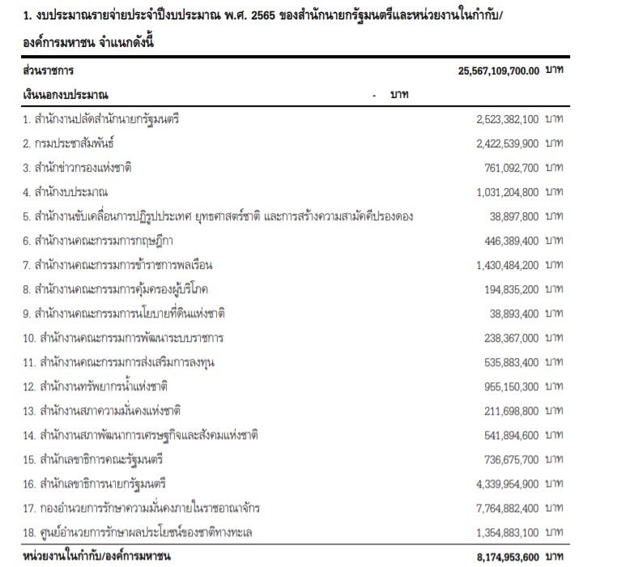
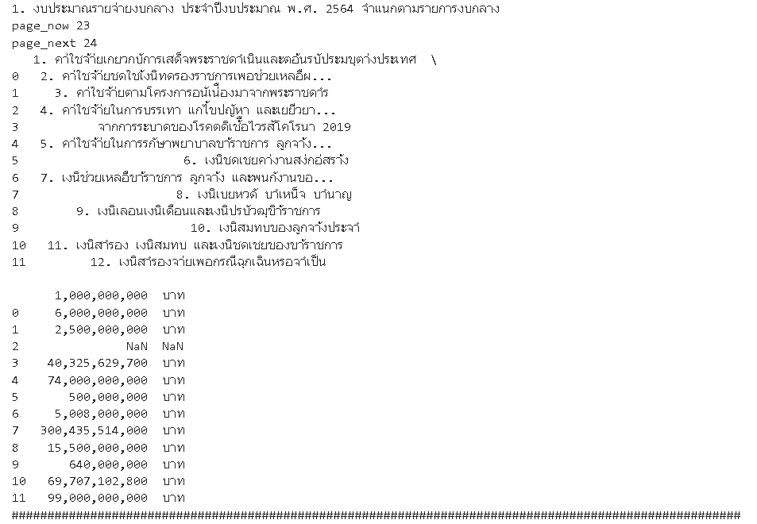
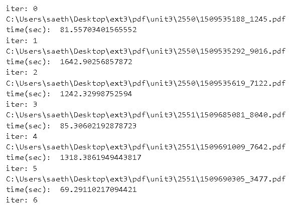

# Tables-extraction-from-pdf-with-Python

Thailand Development Research Institute (TDRI)| Arpil 2021 - July 2021

Extract tables from [Budget reports of 'Bureau of the Budget, Thailand'](https://www.bb.go.th/topic3.php?gid=862&mid=545) and save to CSV format.

***1. Auto download pdf files from websites to a lacal machine.***

An example of a table in pdf.

Link to the code: [pdf auto download](https://github.com/saeth40/Tables-extraction-from-pdf-with-Python/blob/main/AutoDownload.ipynb)

***2. Test tables extraction function.***

Link to the code: [Test tables extraction](https://github.com/saeth40/Tables-extraction-from-pdf-with-Python/blob/main/Test_tables_extraction.ipynb)

***3. Run tables extraction function in pdf files.***

Link to the code: [Run tables extraction](https://github.com/saeth40/Tables-extraction-from-pdf-with-Python/blob/main/Run_tables_extraction.ipynb)
